#   Manual de configuracion 
##  Configuracion de red privada usando Google Cloud
En este repositorio es una guia rapida de configuracion para la creacion de una red privada lo cual simula una red WLAN utilizando los servicios de Google Cloud y una OpenVPN para permitir la conecticidad entre distintos usuarios/dispositivos y llevar de manera segura  operaciones.

#  Google Cloud
##  Configuracion

- Para la utilizacion de los servicios de Google Cloud debemos contar con una cuenta en esta plataforma de [Google Cloud](https://cloud.google.com/google/googlecloud)  la cual se puede crear con una cuenta de Gmail
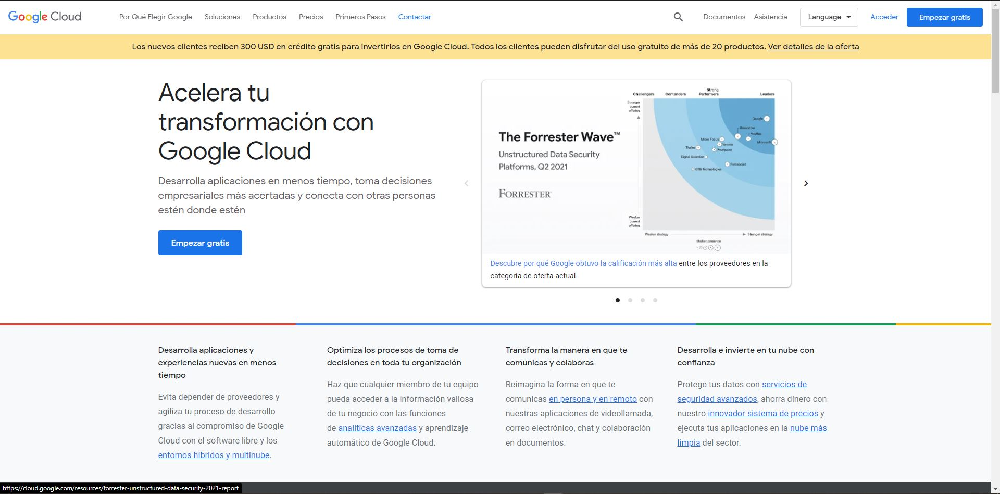
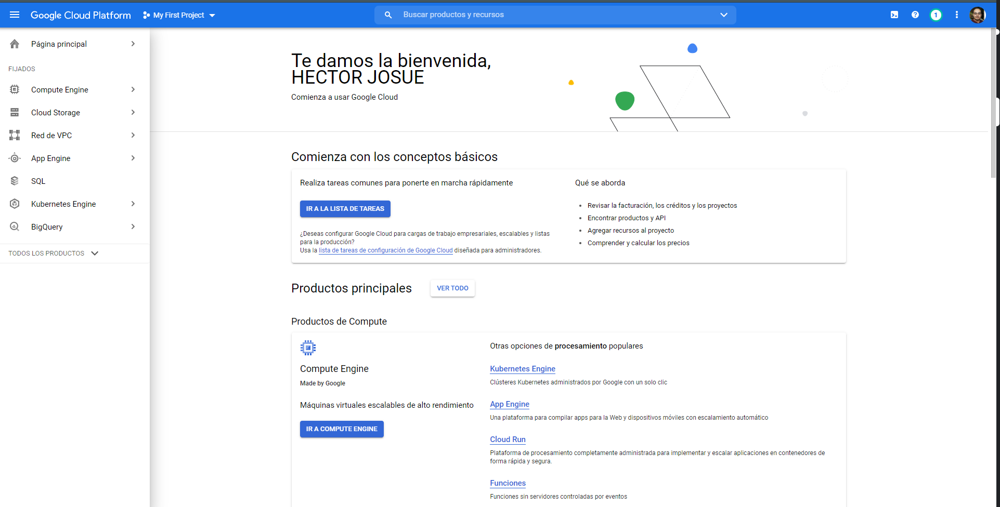

-   Para la creacion de esta red se utilizara una maquina virtual por lo cual se creara un nuevo proyecto en esta plataforma.
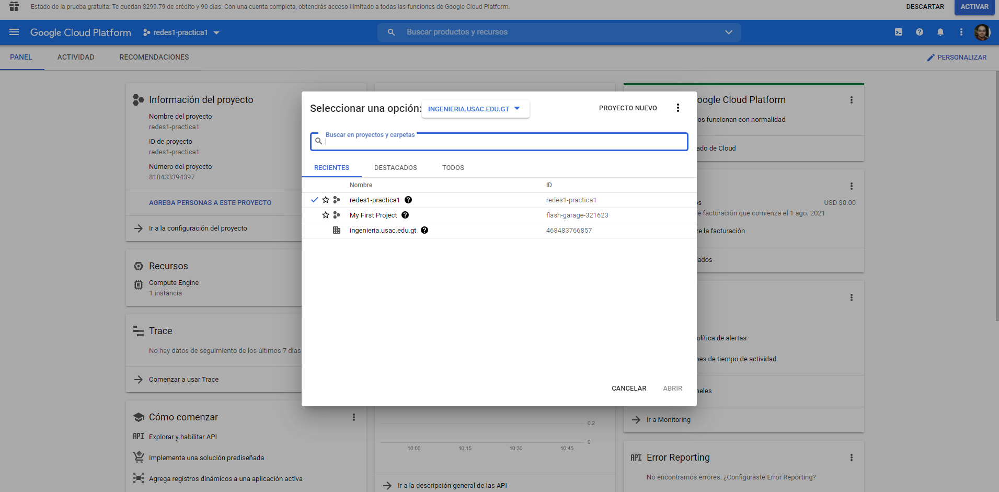

-   Una vez que inicialicemos el proyecto nos despliega la opcion de inicializar la API en la opcion de Compute Engine API en la plataforma 
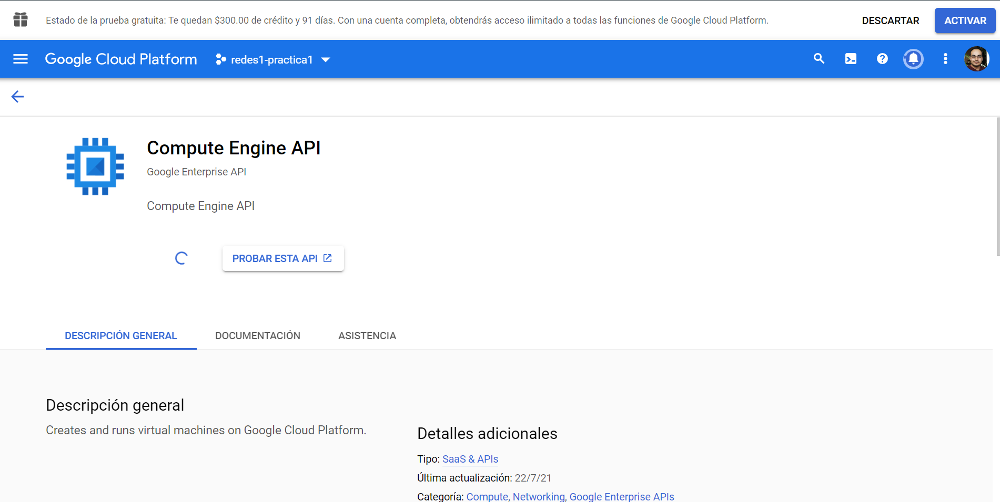

-   Cuando la API se encuentre inicializada procederemos a instanciar una nueva maquina virtual, para ello nos dirigimos al menu de lado izquierdo y seleccionamos la opcion de Nueva Instancia de VM.
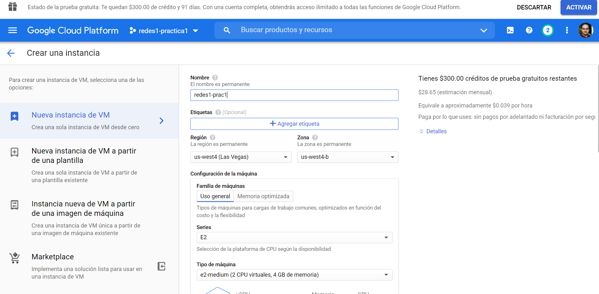

-   Procedemos a configurar el servidor de nuestra maquina virtual, para ello utilizamos la siguiente configuración.
    -  Nombre: redes1-prac1
    -  Region: us-west4 (Las Vegas)
    -  Zona: us-west4-b
    -  Configuracion de la maquina
       -  Familia de maquinas: Uso general
       -  Series: E2
       -  Tipo de maquina: e2-medium(2 CPU virtuales, 4 GB de memoria)
     - Identidad y acceso de la API
       - Cuenta de servicio: Compute Engine default service account
       - Permiso de acceso: Permitir el acceso predeterminado
     - Firewall:
       - [x] Permitir trafico HTTP
       - [x] Permitir trafico HTTPS 

-   Luego de configurar la maquina virtual procederemos a hacer click en el boton de crear.

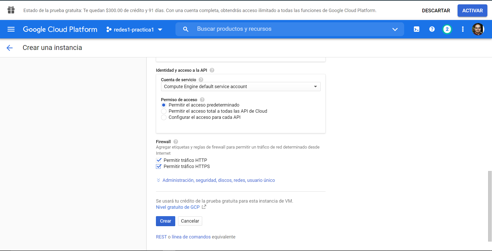

-   Luego de la previa configuracion se muestra el estado en el que se encuentra nuestra maquina virtual creada, una vez que esta tenga el estado activo (verde) nos dirigimos a la consola de la maquina virtual haciendo click en SSH dentro de la columna "Conectar".
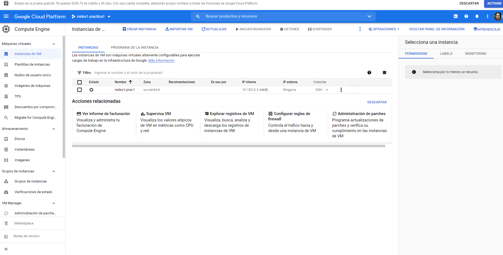

-   Se nos despliega la consola de nuestra maquina virtual, procederemos a actualizar los paquetes de la maquina virtual utilizando el comando:
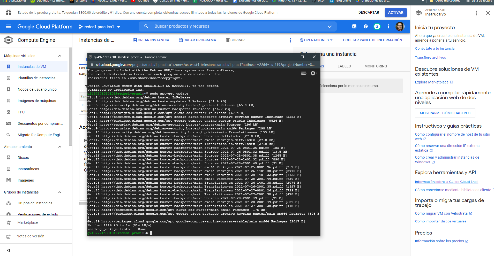

```txt
sudo apt-get update
```

-   Posteriormente instalamos la herramienta wget utilizando el siguiente comando:
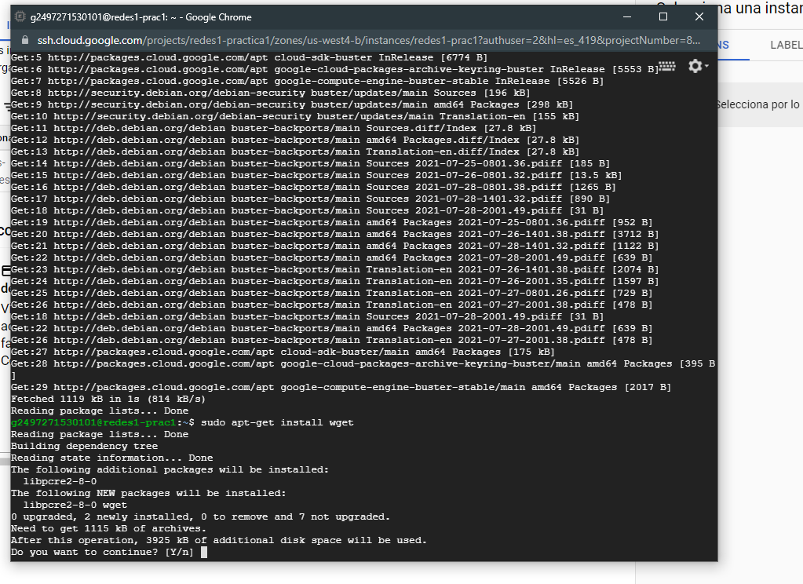

```txt
sudo apt-get install wget
```
y confirmamos con la tecla Y para continual.

---
# OpenVPN
-   Procederemos a instalar en nuestra maquina virtual la herrameinta de OpenVPN con el siguiente comando:

```Text
sudo wget https://cubaelectronica.com/OpenVPN/openvpn-install.sh
```


-   Posteriormente de instalar la herramienta de OpenVPN dentro de nuestra maquina virtual se nos despliega nueva informacion en la consola en la cual se realizara la configuracion de cada una de las VPN para cada usuario
-   Se nos solicita la direccion IPv4 publica de nuestro servidor el cual lo podemos obtener en la pagina de Google Cloud en la columna de "IP externa" en nuestro caso es 34.125.187.70
-   Luego de esta configuracion se nos solicita seleccionar el tipo de protocolo para las conexiones OpenVPN y seleccionamos la opcion 
    - UDP (ingresar opcion 1)
-   Posteriormente nos solicita el puerto en el cual se escuchara OpenVPN colocando en este caso utilizaremos el puerto:
    -   1194

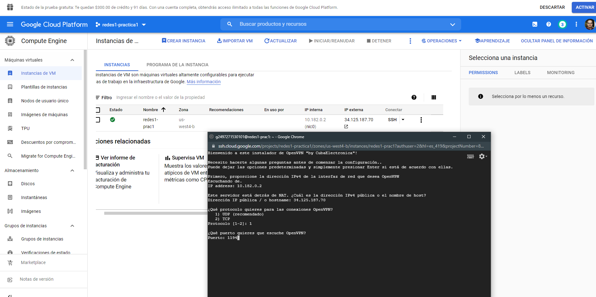 

- A continuacion nos solicital el DNS para utilizar con el VPN y seleccionamos la opcion de:
  - Google (ingresar opcion 3)
---

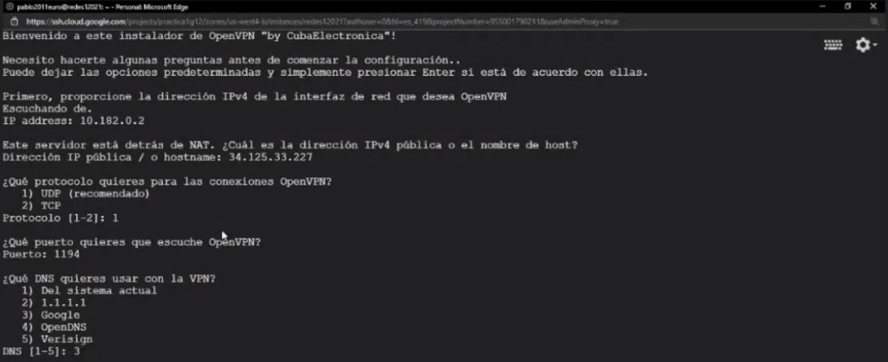 

-   Se nos solicita por ultimo el nombre para el certificado del cliente el cual debe segir las reglas que se indican:
    -   Use solo una palabra
    -   Sin caracteres especiales

luego de ingresar el nombre presionamos cualquier tecla para crear el certificado.

-   Cuando el proceso de la creacion del certificado halla finalizado nos muestra la ruta donde se genero el certificado el cual procederemos a descargarlo, para esto nos dirigiremos a configuracione en el icono de un engrane ubicado en la parte superior derecha y seleccionando la opcion de "Descargar el archivo". Se nos despliega una ventana con un cuadro de texto en el cual colocaremos la ruta donde de guardo el certificado y automaticamente empezara la descarga del mismo.
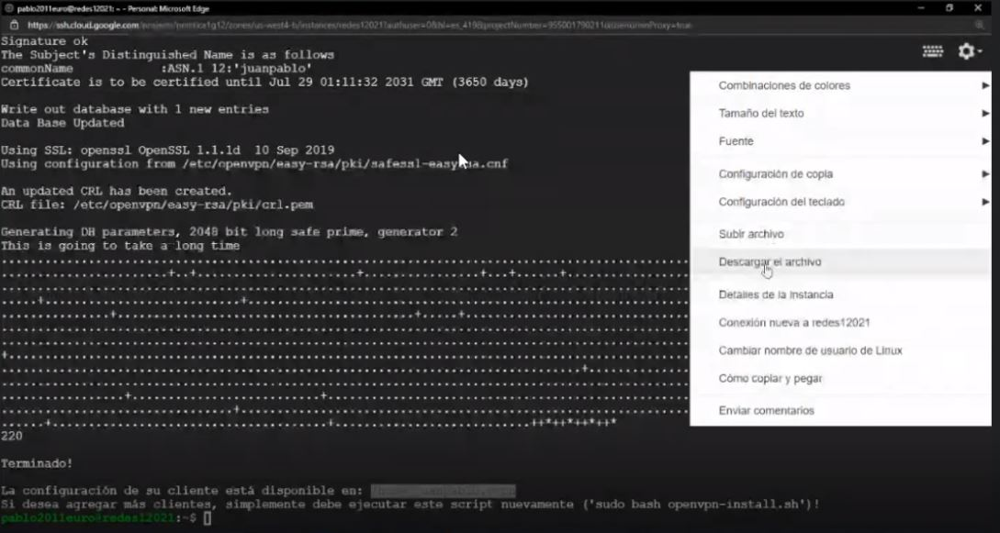


#  Firewall

-   Para configurar el la entrada y salida de datos nos digimos al servicio de "Redes de VPC" y seleccionamos la opcion de Firewall.
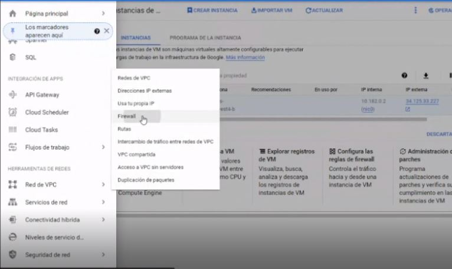

-   Procederemos a crear las reglas para el firewall de entrada y salida haciendo click en la opcion de crear nueva regla.
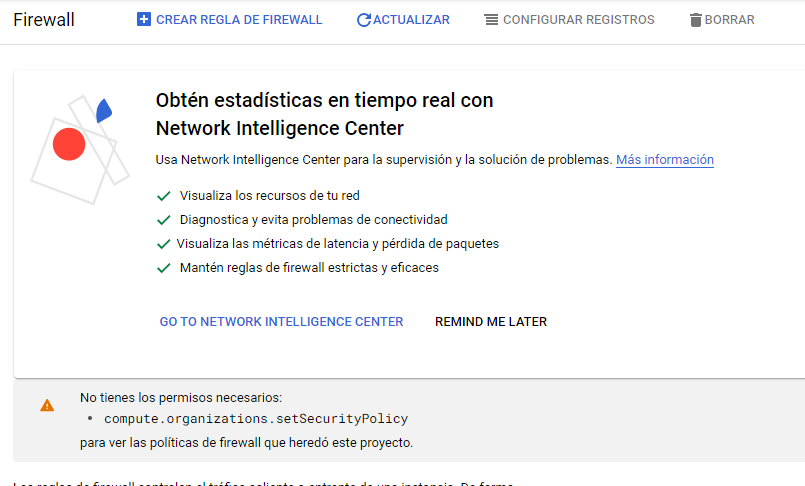

-   Procederemos a configuracion de la primera regla de entrada para el servicio con las siguientes configuraciones:
    -   allin

        -   Nombre: allin
        -   Descripcion: allin
        -   Registros: Desactivada
        -   Red: default
        -   Prioridad: 1000
        -   Direccion: Entrada
        -   Accion en caso de coincidencia: Permitir
        -   Filtros de fuente
            -   Rangos de IP: 0.0.0.0/0
        - Protocolos y puertos
          - udp: 1194
        - Aplicacion: Habilitada
        - Estadisticas: Ninguno
        - Supervision de aciertos: -
        - Aplicable a las instancias: Todas las instancias.
        <br><br>
    -   allout
        -   Nombre: allout
        -   Descripcion: allout
        -   Registros: Desactivada
        -   Red: default
        -   Prioridad: 1000
        -   Direccion: Entrada
        -   Accion en caso de coincidencia: Permitir
        -   Filtros de fuente
            -   Rangos de IP: 0.0.0.0/0
        - Protocolos y puertos
          - udp: 1194
        - Aplicacion: Habilitada
        - Estadisticas: Ninguno
        - Supervision de aciertos: -
        - Aplicable a las instancias: Todas las instancias.
    <p>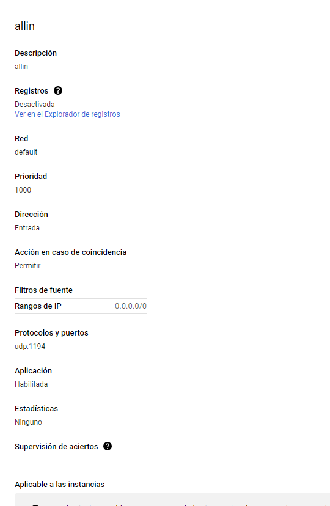
    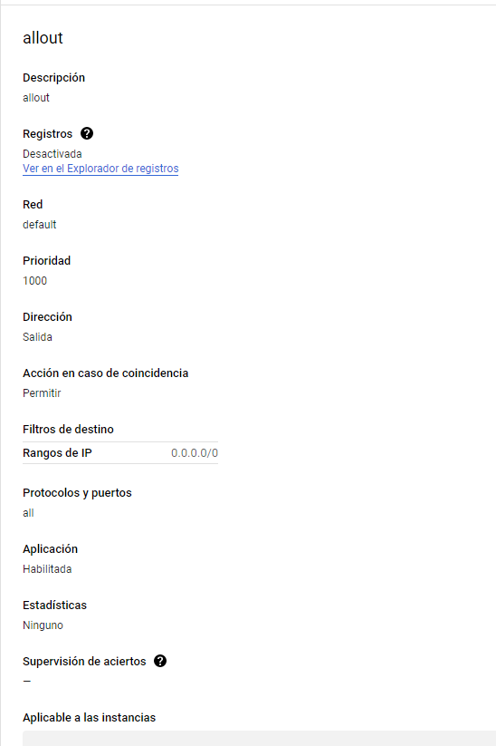</p>
    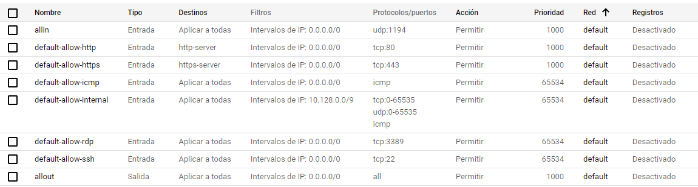

---
#   Descarga de software OpenVPN
-   Para la descarga y utilizacion de este software nos dirigiremos a su pagina oficial [OpenVPN](https://openvpn.net/vpn-client/) y daremos click en "Download OpenVPN Connect" 


-   Una vez instalado el programa podremos observar la siguiente interfaz
<center>
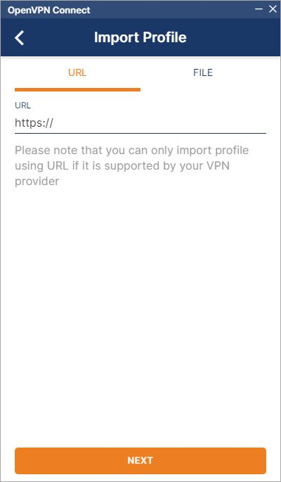
</center>
-   Para la importacion de el certificado para cada uno de los usuarios daremos click en la opcion de "Import File" y seleccionamos el archivo .ovpn 
<p>
<center>
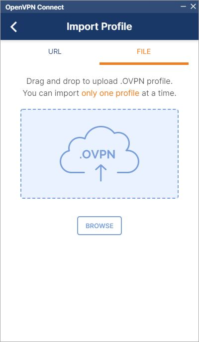

</center>
</p>
<br><br>

---
#   Conexion a nuestra red WLAN
-   Se configurara el Firewall de nuestro equipo, para ello nos direigiremos al buscador de windows e ingresamos "Firewall". 
<center>
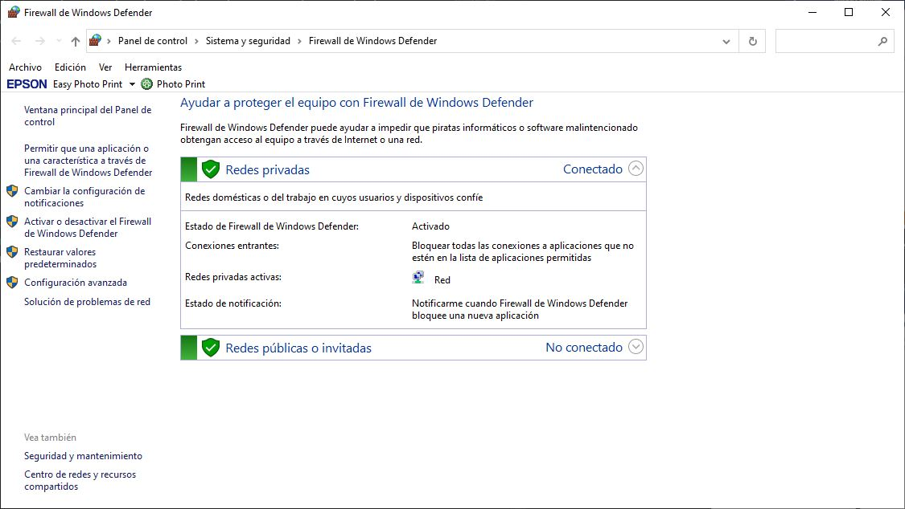
</center>

-   Desactivaremos Windows defender pare ello nos dirigiremos a la opcion de lado iquierda de la ventana "Activar o desactivar el Firewall de windows Defender" y seleccionamos en ambas configuraciones
    -   Desactivar
<center>
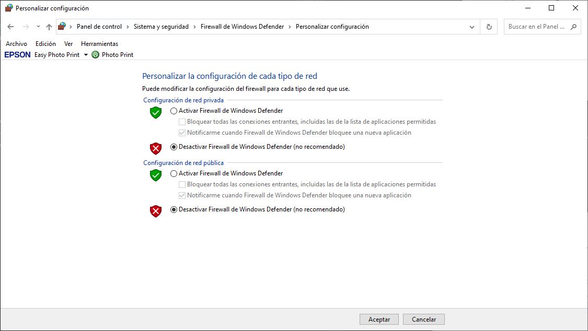
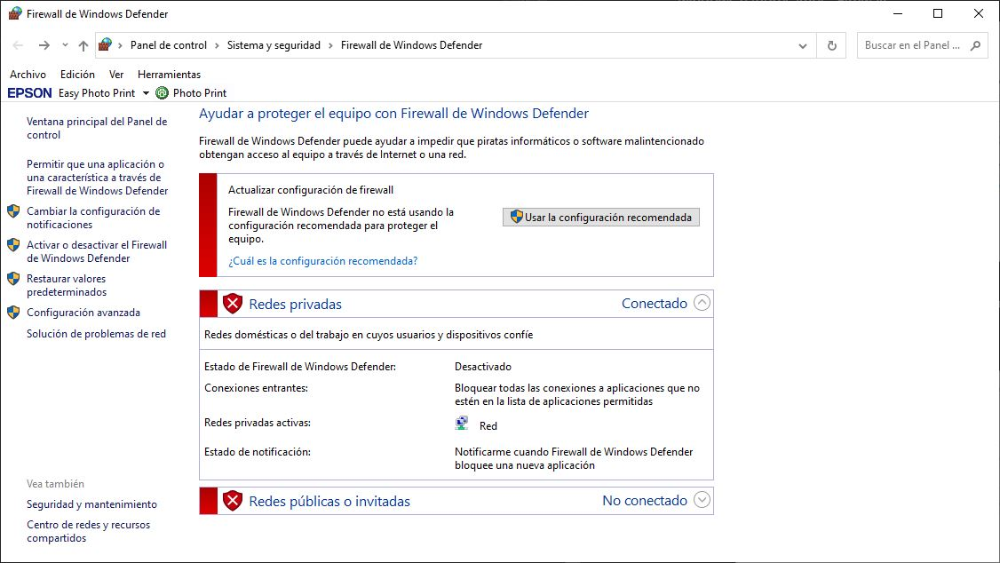
</center>

- Procederemos a conectar el vpn con el certificado cargado en el programa.
<center>
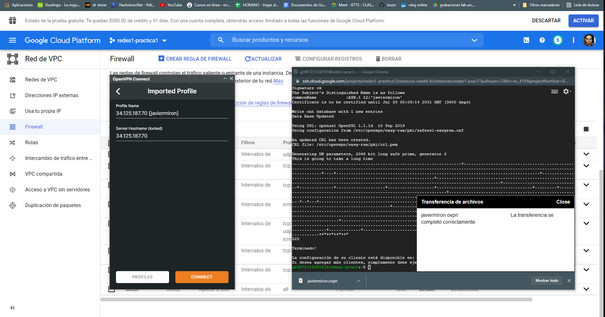
</center>

---
#   Pruebas de conexion
-   Para obtener el protocolo de nuestra direccion ip para cada uno de los usuarios conectados al servicion nos dirigiremos a nuestra consola de windows e ingresaremos el siguiente comando:
``` Text
ipconfig
```
<center>
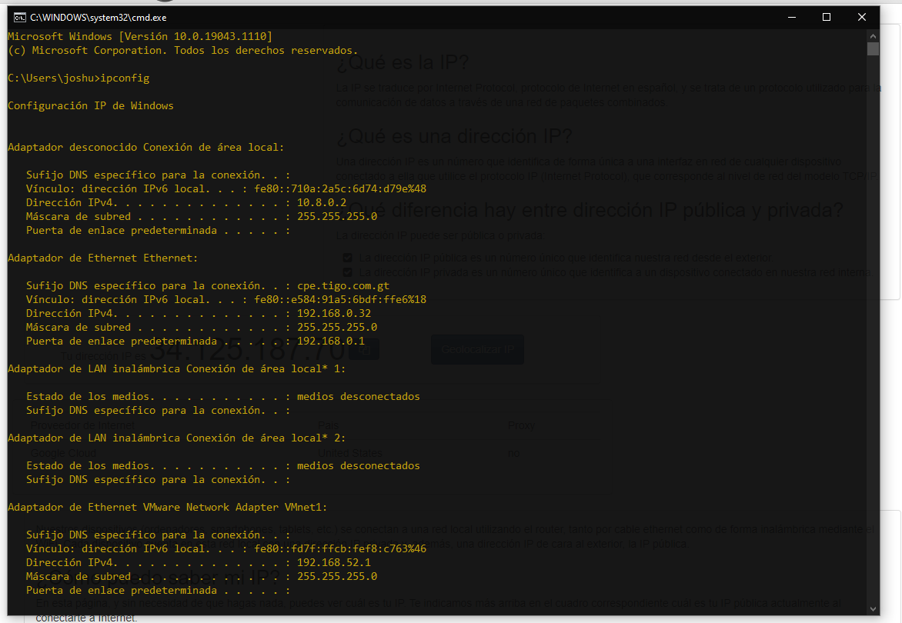
</center>

-   Para la prueba de conexion entre un cliente(10.8.0.4)/servidor(10.8.0.1) utilizaremos el comando:
``` Text
ping 10.8.0.1
```
<center>
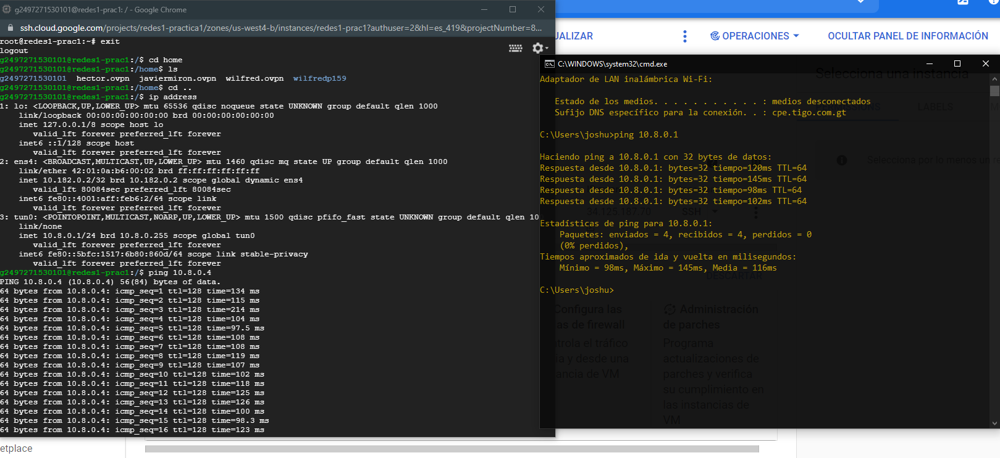
</center>

---
#   Test de Conexion entre todos los equipo

-   Conexion entre usuarios dentro de la misma red
    -   Servidor: 10.8.0.1
    -   Usuario1(Javier): 10.8.0.2
    -   Usuario2(Wilfred): 10.8.0.3
    -   Usuario3(Hector): 10.8.0.4
<p>
<center>
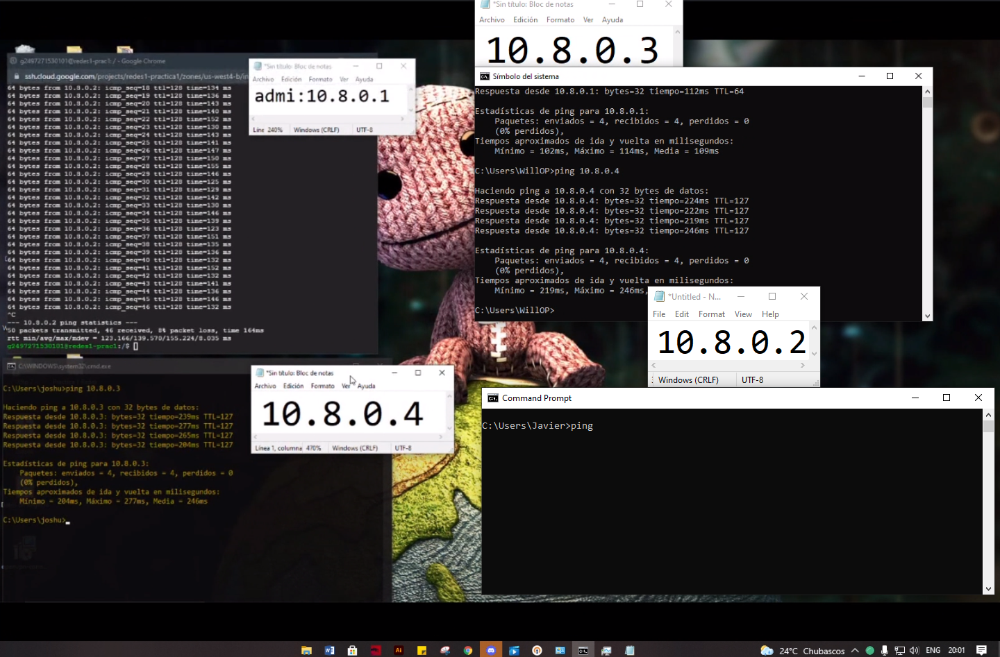
<br><br>
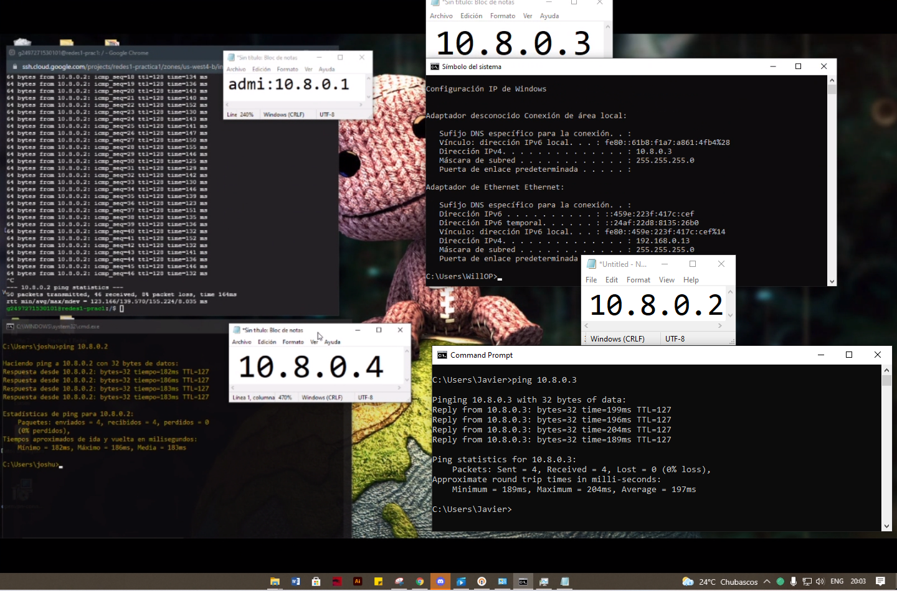
<br><br>

</center>
</p>
